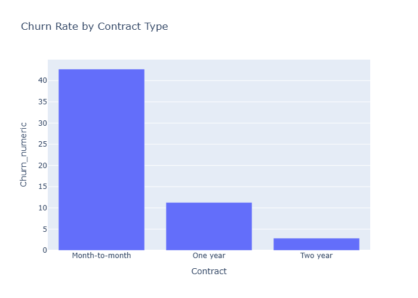
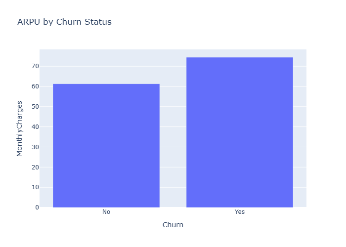

# Telecom Billing Insights Report

This report provides key insights from customer billing data, helping to improve decision-making and business strategy.

## Key Performance Indicators (KPIs)

* **Overall Churn Rate**: 26.58%

---

## Insight 1: Churn by Contract Type

The chart above shows how customer churn changes based on contract length.

### Explainable AI (What this means for the business) 🤖

This is a major business insight. Our **month-to-month** customers are leaving at a very high rate—nearly half of them. This tells us they don't feel committed to our service. In contrast, our **two-year** contract customers are extremely loyal, with almost no churn. This is a call to action to create incentives for short-term customers to sign a longer contract.

---

## Insight 2: Average Revenue Per User (ARPU)

This chart compares the average monthly revenue from customers who left versus those who stayed.

### Explainable AI (What the business should do) 💡

This finding is both surprising and important. We're losing our **highest-value customers**—the ones who spend the most each month. This means we can't just focus on acquiring new customers; we must prioritize the retention of our premium users. We should consider launching a dedicated customer success program or special perks for our high-spending clients to ensure they feel valued and stay with us.

---

## Churn Prediction Model

To be proactive about customer churn, we built a machine learning model to predict which customers are most likely to leave. The model was trained using a Random Forest Classifier on our cleaned dataset.

### Model Performance

* **Accuracy:** 78.54%
* **Confusion Matrix:**
    | | Predicted: No Churn | Predicted: Churn |
    |---|---|---|
    | **Actual: No Churn** | 927 | 106 |
    | **Actual: Churn** | 196 | 178 |

### Business Implications and Recommendations

This model allows us to take action to save at-risk customers.

* **Saving At-Risk Customers (True Positives):** The model correctly identified **178 customers** who were going to churn. This gives us a direct list of customers to target with retention efforts, such as special discounts or personalized support. This is the **primary business value** of the model.
* **Missed Opportunities (False Negatives):** The model failed to predict that **196 customers** would churn. This is the **cost of the model's error**, as we missed the chance to save these customers. A business would want to reduce this number as much as possible. 

### Next Steps

To improve the model and our business strategy, we can:

* **Fine-tune the model:** Experiment with different machine learning algorithms (e.g., Logistic Regression or Gradient Boosting) or tune the current model's parameters to improve its accuracy, especially in reducing false negatives.
* **Gather more data:** Incorporate new data points, such as customer support call logs or survey results, to provide the model with a more complete picture of customer behavior.
* **Develop a retention strategy:** Use the model's predictions to create targeted marketing campaigns or special offers for the customers it identifies as high-risk.